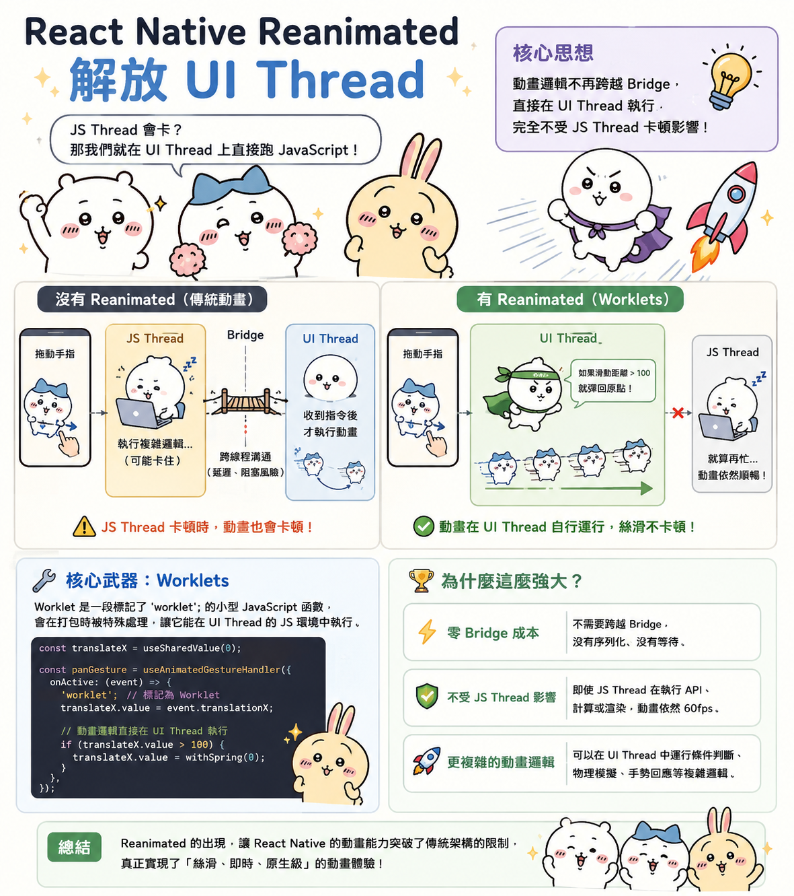

---
mdx:
  format: md
---

> 課程：RN 跨平台開發基礎
> 第 11 堂：效能基礎全覽

# 動畫優化與診斷工具

想像一下這個場景：你正在開發一款內容管理 APP，使用者點擊「按鈕」後，APP 需要從 API 抓取 500 筆資料，進行複雜的分類排序，同時還要播放一個優雅的頁面切換動畫。

結果呢？動畫卡住了半秒，然後突然跳到終點。

明明我們在上一節課已經用了 `React.memo` 和 `useCallback` 減少了不必要的 re-render，為什麼動畫還是會掉幀（Frame Drop）？這就是我們今天要探討的核心：當 JS Thread 忙著算帳時，誰來負責畫畫？

## 動畫的兩難：為什麼會掉幀？

在 React Native 中，傳統的 `Animated` API 有兩種運作模式。理解這兩者的差異，是優化效能的第一步。

### 1. JS-driven 動畫（不使用 Native Driver）

當你設定 `useNativeDriver: false`（或者是處理那些不支援原生驅動的屬性，如 `flexbox` 佈局屬性）時，動畫的每一幀計算都是在 **JS Thread** 完成的。

過程如下：

1. JS Thread 計算下一幀的數值（例如：透明度從 0.1 變成 0.12）。
2. 透過 Bridge 將新數值傳送給 UI Thread。
3. UI Thread 更新畫面。
4. 重複以上步驟，每秒 60 次。

**致命傷：** 如果這時候 JS Thread 正在忙著處理一個大型的 JSON 解析，或者是在跑一個複雜的迴圈，它就沒辦法準時在 16.67ms 內交出下一幀的數值。結果就是：UI Thread 沒收到指令，畫面停在那裡，這就是我們看到的「卡頓」。

### 2. Native-driven 動畫（使用 Native Driver）

當你設定 `useNativeDriver: true` 時，JS Thread 會在動畫開始前，將「整套動畫劇本」一次性發送給 UI Thread。

**過程如下：**

1. JS Thread：「嘿，我要把這個 View 的 `opacity` 從 0 變到 1，耗時 500ms，曲線是 linear。」
2. UI Thread：「收到了，接下來交給我。」
3. JS Thread 去處理它的 API 資料了，UI Thread 獨自在原生層流暢地執行每秒 60 幀的渲染。

**局限性：** 傳統 `Animated` 的 Native Driver 只能處理非佈局屬性（如 `opacity`、`transform`）。如果你想讓一個元件的 `height` 或 `width` 跟著動畫變動，傳統 API 就無能為力了，它必須回到 JS Thread 去計算佈局。

## React Native Reanimated：解放 UI Thread

為了解決上述限制，社群推出了 **React Native Reanimated**（目前主流為 v2/v3）。它的設計哲學非常激進：**既然 JS Thread 會卡，那我們就在 UI Thread 上直接跑 JavaScript。**

### 核心武器：Worklets

Reanimated 引入了「Worklets」的概念。這是一段標記了 `'worklet';` 指令的小型 JavaScript 函數。這些代碼在打包時會被特殊處理，讓它們能夠直接在 **UI Thread** 的 JavaScript 環境中執行。

這意味著：

- 動畫邏輯（例如：如果滑動距離大於 100，則彈回原點）不再需要跨越 Bridge。
- 它們直接在 UI Thread 執行，完全無視 JS Thread 是否正在忙碌。



### 實戰對比：資料處理 vs 動畫

假設我們有一個「排行榜」功能，點擊刷新時會進行大量運算：

**場景 A：使用 Animated API**
當你點擊「刷新」，JS Thread 開始排序 10,000 筆數據，同時側邊選單正在收合。因為排序佔滿了 JS Thread，側邊選單會卡在半路，等數據排完了才猛然跳回。

**場景 B：使用 Reanimated**
同樣點擊「刷新」，JS Thread 依舊在忙著排序。但因為選單收合的邏輯寫在 `useAnimatedStyle` 中，運行在 UI Thread 的 Worklet 上，選單會依然保持 60fps 的極致流暢，使用者甚至不會察覺背景正在進行繁重運算。

### Reanimated 的心智模型

在 Reanimated 中，我們不再使用一般的 `state` 來驅動動畫，而是使用：

- **useSharedValue**: 一個可以在兩個執行緒間共享的數值（類似於 `Animated.Value`，但更強大）。
- **useAnimatedStyle**: 定義動畫如何根據 `SharedValue` 變化，這段代碼跑在 UI Thread。

```javascript
const offset = useSharedValue(0);

const animatedStyles = useAnimatedStyle(() => {
  return {
    transform: [{ translateX: offset.value }], // 直接在 UI Thread 讀取與計算
  };
});
```

## 效能診斷的「醫療器材」

當你覺得 APP 卡頓，但又不知道是 JS Thread 太忙、UI Thread 渲染太重，還是 re-render 次數太多時，你不能靠猜測。你需要精準的工具。

### 1. React DevTools Profiler：捉拿多餘的渲染

這是診斷「JS 層效能」的神器。在 Flipper 或獨立版 DevTools 中開啟 Profiler，錄製一段操作後，你會看到：

- **火焰圖 (Flamegraph)**：顯示每個元件渲染耗時。
- **為什麼這個元件會渲染？**：這是最值錢的功能。它會明確告訴你是因為 `props` 改變了，還是父元件更新了。
- **顏色密碼**：黃色代表耗時較長，藍色代表較短，灰色代表沒有重新渲染。

**開發者任務：** 尋找那些「明明數據沒變卻變黃」的元件，這通常就是沒寫好 `React.memo` 或 `useCallback` 的地方。

### 2. Flipper：你的開發指揮中心

不要只把 Flipper 當成看日誌的工具。它是 React Native 的「綜合體檢機」：

- **Network 監控**：觀察 API 回傳是否太大，導致 JS Thread 解析 JSON 耗時太久。
- **Images 檢查**：確認你是不是在一個 100x100 的頭像框裡，載入了一張 5MB 的原圖。
- **Layout Inspector**：查看原生層級的 UI 結構，確認是否有過深的巢狀 View 導致渲染負擔。

### 3. Hermes 引擎：效能的底層燃料

現在 React Native 預設使用 **Hermes** 引擎。為什麼它對效能這麼重要？

在傳統模式下，手機下載 JS Bundle 後，需要先進行「編譯」才能執行。而 Hermes 採用 **AOT（Ahead-of-Time）編譯**。

- **原理**：在你的電腦打包 APP 時，Hermes 就已經把 JavaScript 翻譯成了「位元組碼 (Bytecode)」。
- **好處**：手機拿到的是已經「消化過」的代碼。這大大縮短了 **TTI（Time to Interactive）**，也就是 APP 打開到使用者能操作的時間，同時也減少了記憶體佔用。

如果在診斷時發現啟動速度慢，請務必確認 `android/app/build.gradle` 中的 `enableHermes: true` 是否開啟。

## 診斷與優化的標準流程

當你遇到效能問題時，建議遵循以下路徑，而不是亂投藥：

1. **開啟 Perf Monitor**：在開發者選單開啟「Show Perf Monitor」，看看到底是 **UI FPS** 掉幀（通常是渲染層級太深、圖片太大）還是 **JS FPS** 掉幀（通常是邏輯太重、re-render 頻繁）。
2. **用 Profiler 檢查 JS Thread**：如果是 JS 掉幀，找出那個「最長、最黃」的元件。
3. **檢查動畫驅動**：如果是動畫卡頓，確認是否用了 `useNativeDriver: true`，或者考慮升級到 **Reanimated**。
4. **檢查圖片與資源**：在內容類 APP 中，這往往是記憶體爆炸的元兇。

---

## 建立高效能的開發直覺

優化效能不應該是專案結束前的「大掃除」，而應該是開發過程中的「衛生習慣」。在本章中，我們深入探討了 React Native 效能優化的最高境界：從單純的減少渲染，進化到對執行緒分工的掌控。

我們了解了為什麼傳統動畫會受到 JavaScript 邏輯的牽連，並學習了如何利用 **Reanimated** 將運算壓力轉移到更強大的 **UI Thread**。同時，我們掌握了 **React DevTools**、**Flipper** 與 **Hermes** 這些專業工具，讓效能診斷從「通靈」變成「科學」。

至此，我們已經完成了 Topic 7 的所有學習，你現在具備了讓 APP 不僅能跑，還能跑得滑順、跑得專業的底層知識。

在下一堂課中，我們將進入最後一個大主題：**Topic 8: APP 架構規劃**。我們將把這幾堂課學到的渲染優化、狀態管理、導覽設計與原生功能，整合成一套可維護、可擴展的專案架構思維。
