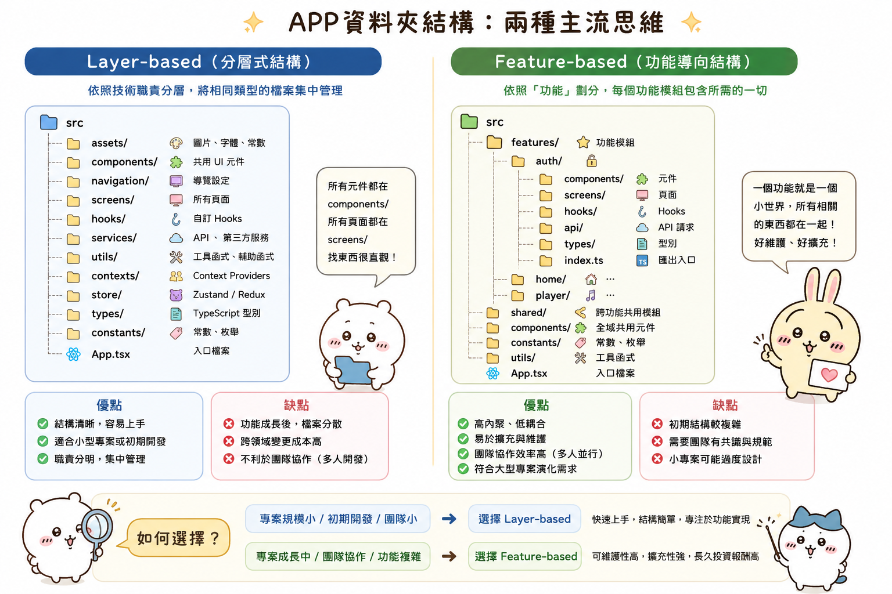

---
mdx:
  format: md
---

> 課程：RN 跨平台開發基礎
> 第 12 堂：APP 架構規劃

# 資料夾結構哲學

想像一下，你正準備為你的 APP 開發一個全新的「音訊播放器」功能。你需要建立一個用於顯示進度的元件、一個處理播放邏輯的自定義 Hook、一個存取音檔 API 的 Service，以及一個存放播放狀態的 Context。

如果你目前的專案結構是把所有元件放在 `components/`，所有 Hook 放在 `hooks/`，所有服務放在 `services/`，那麼在開發過程中，你的開發環境（如 VS Code）側邊欄會看起來像是一座迷宮。為了改動一個播放器功能，你必須在四、五個完全不同的資料夾之間來回跳躍。當專案只有 10 個檔案時，這不是問題；但當你的 APP 成長到有 50 個螢幕、200 個元件時，這種結構就會變成開發者的噩夢。

這就是我們今天要探討的核心：**資料夾結構不只是檔案的擺放方式，它反映了你的架構思維。** 好的結構應該讓你「直覺地找到程式碼」，並在修改功能時，將影響範圍控制在最小的區域。

## Layer-based 結構：直覺的起點及其崩潰點

大多數開發者在剛接觸 React Native 或前端開發時，最直覺採用的就是 **Layer-based（基於層級/技術職責）** 的結構。這種結構是根據程式碼「是什麼」（技術屬性）來分類的。

### 典型的 Layer-based 結構範例

```text
src/
├── assets/          # 圖片、字體、靜態資源
├── components/      # 所有的 UI 元件 (Button, Card, PlayerView...)
├── hooks/           # 所有的自定義 Hooks (useAuth, usePlayer, useFetch...)
├── screens/         # 所有的頁面組件 (Home, Detail, Settings...)
├── services/        # API 請求、外部套件封裝
├── store/           # 全域狀態管理 (Zustand, Redux)
├── utils/           # 工具函式 (formatDate, validator)
└── App.tsx
```

### 為什麼我們一開始會喜歡它？

1. **極低的認知負擔**：當你想寫一個 Hook，你就去 `hooks/`；當你想寫一個工具函式，你就去 `utils/`。對於初學者來說，這種分類邏輯非常清晰。
2. **找「某種類型」的東西很快**：如果你今天想統一優化專案中所有的 API 呼叫邏輯，你只要打開 `services/` 就能一覽無遺。

### 隨之而來的「痛點」：分散的上下文

隨著 APP 功能增加，Layer-based 結構會開始顯露其弊端：

- **資料夾過度膨脹**：在一個成熟的內容類 APP 中，`components/` 資料夾很可能會堆積超過 100 個檔案。即便你嘗試在裡面分層（如 `components/common/`），搜尋成本依然會大幅上升。
- **低內聚性（Low Cohesion）**：這是最嚴重的問題。假設你要修復「人類圖閱讀器」中「解析圖表」功能的 Bug。你可能需要同時打開 `services/chartApi.ts`、`hooks/useChartData.ts`、`components/ChartVisualizer.tsx` 和 `screens/ChartDetail.tsx`。這四個檔案散落在專案的四個角落，在視覺上和心理上，它們都被迫與其他無關的程式碼混在一起。
- **重構困難**：當你想把「解析圖表」功能完整搬移到另一個專案，或是想徹底刪除它時，你必須像玩「掃雷」一樣，在各個資料夾中尋找遺留的碎片，漏掉一個就會導致編譯錯誤。

**預測一下**：當你的 APP 進入封測後期，功能趨於複雜，你是否發現自己在 VS Code 的檔案切換標籤（Tabs）越來越多，且經常忘記哪個 `utils` 是為了哪個功能寫的？這就是結構在對你發出求救訊號。

---

## Feature-based 結構：以業務邏輯為核心

為了克服上述痛點，中大型專案通常會轉向 **Feature-based（基於功能/業務模組）** 的結構。這種結構的核心哲學是：**把「為了完成同一件事」而存在的程式碼放在一起。**

### 典型的 Feature-based 結構範例

在這種結構下，`src/features/` 是專案的心臟。

```text
src/
├── features/
│   ├── auth/                # 登入註冊模組
│   │   ├── components/      # 僅限登入用的 LoginForm
│   │   ├── hooks/           # useLogin, useLogout
│   │   ├── services/        # authApi
│   │   └── index.ts         # 對外暴露的 API
│   ├── player/              # 音訊播放模組
│   │   ├── components/      # ProgressBar, PlayButton
│   │   ├── hooks/           # useAudioEngine
│   │   ├── store/           # 播放器的內部狀態
│   │   └── types.ts
│   └── chart-reader/        # 人類圖解析模組
│       ├── components/
│       ├── utils/           # 計算圖表的特定演算法
│       └── constants.ts
├── shared/                  # 跨功能共用的資源 (下一節詳述)
└── App.tsx
```

### 為什麼這會讓開發變得很「爽」？

1. **高內聚、低耦合**：當你在開發「播放器」功能時，你幾乎只需要待在 `src/features/player/` 這個資料夾裡。所有的相關邏輯都在手邊，心理負擔極小。
2. **檔案規模可控**：每個資料夾內的檔案數量都維持在個位數或十位數，不會出現「百件檔案大雜燴」的情況。
3. **AI 協作的隱形優勢**：當你使用 AI（如 Cursor 或 GitHub Copilot）時，如果你打開的檔案都在同一個功能資料夾內，AI 獲取的「上下文（Context）」會更精準。它能輕易理解 `ProgressBar` 和 `useAudioEngine` 之間的關係，因為它們在物理距離上就很接近。
4. **清晰的邊界（Public API）**：透過每個 feature 資料夾下的 `index.ts`，你可以定義哪些東西是「允許被外部使用的」。這能防止其他功能隨意讀取播放器內部的私有狀態，維持專案的整潔。

---

## 混合策略：現實世界的權衡

雖然 Feature-based 很強大，但我們無法避免某些東西就是會被「多個功能」用到。例如你的 `AppButton`、`ThemeConfig` 或是 `formatDate` 工具。

這就是為什麼我們需要一個**混合結構**，引入 `shared`（或稱 `common`、`core`）層來存放這些共用資產。

### 結構實戰建議

對於你的兩款 APP（人類圖閱讀器與 AuraFlow），一個理想的架構會長這樣：

1. `**src/shared**`** (或 **`**src/core**`**)**：
  - **Components**: 存放你在 Topic 2.7 封裝的設計系統元件（如 `AppText`, `Container`, `Card`）。
- **Theme**: 存放顏色、字體大小等 Design Tokens。
- **Hooks**: 存放通用的 Hook，如 `useWindowDimensions` 或 `useForm`。
- **Utils**: 存放不具備業務邏輯的純工具，如 `currencyFormatter`。
2. **`src/features`**：
  - **人類圖閱讀器**：可以拆分為 `chart-reading`（核心繪圖與解析）、`user-profile`（儲存家人朋友的圖表）、`knowledge-base`（人類圖知識庫文章）。
- **AuraFlow**：可以拆分為 `audio-player`（核心播放邏輯）、`community`（討論區/留言）、`membership`（訂閱與權限控制）。

### 關於 Topic 2.7 的關聯性

回憶我們在 Topic 2.7 討論過的「設計系統」。當時我們強調要把樣式 Token 化並封裝共用元件。在 Feature-based 結構下，這些東西應該被視為專案的「基礎建設」，統一放在 `src/shared/components` 裡。

當一個 Feature 需要顯示文字時，它不應該定義自己的 `TextStyle`，而是去引用 `shared` 層的 `AppText`。這樣一來，即使各功能內部的邏輯高度隔離，視覺上依然能保持完美的系統性一致。

---

## 如何決定你的 APP 該用哪種結構？

我們來做一個簡單的決策測驗：

- **如果你的 APP 符合以下情況，建議使用 Layer-based：**
  - 總頁面數在 5 頁以內。
- 這是一個驗證概念的 MVP（最小可行性產品）。
- 專案檔案總數不超過 30 個。
- *結論*：過度設計反而會增加初期開發速度的負擔。
- **如果你的 APP 符合以下情況，必須轉向 Feature-based：**
  - 已經有超過 10 個 Screen。
- 存在明顯的功能模組（如：有播放器、有商城、有圖表工具）。
- 你開始覺得「找檔案」是一件煩人的事。
- 你希望未來能更容易地維護或擴充特定功能。
- *結論*：你的兩款 APP 目前正處於這個轉型點。

### 命名的小技巧：`index.ts` 的妙用

在 Feature 結構中，強烈建議使用 `index.ts` 作為「守門員」。

```typescript
// src/features/player/index.ts

// 只有被 export 的，外部才能 import
export { PlayerScreen } from './screens/PlayerScreen';
export { usePlayerStatus } from './hooks/usePlayerStatus';

// 內部的私有元件 (如 PlayerBackground) 則不 export，
// 這樣可以防止其他開發者（或 AI）誤用內部元件，維持架構的純淨。
```

---

## 建立適合你的組織策略

在你的專案中，我建議從現在開始嘗試「局部 Feature 化」。你不需要一次性重構整個專案，可以先挑選一個最複雜的功能（例如 AuraFlow 的播放器模組）進行試點：

1. 在 `src` 下建立 `features/audio-player`。
2. 將所有與播放器相關的 Hook、元件、API 程式碼搬移過去。
3. 修復 Import 路徑（這是最痛苦的一步，但之後會很甜）。
4. 建立 `index.ts` 暴露必要的 API。

你會驚訝地發現，當這個功能被「物理隔離」出來後，你的思緒會變得多麼清晰。這也為我們接下來要討論的 API 層封裝奠定了基礎——因為在 Feature 結構下，我們能更清楚地定義：哪些資料流是屬於該功能私有的，哪些又是需要跨模組共享的。



### 總結比較表

| 維度 | Layer-based | Feature-based |
| --- | --- | --- |
| **分類標準** | 技術職責 (Hook, Component) | 業務功能 (Auth, Player) |
| **內聚性** | 低（相關程式碼散落在各處） | 高（相關程式碼聚集在一起） |
| **搜尋檔案** | 專案大時非常困難 | 容易，因為目標範圍小 |
| **AI 友善度** | 中（需手動提供大量上下文） | 高（自然形成的上下文邊界） |
| **適用專案** | 小型專案、快速原型 | 中大型專案、長期維護產品 |

## 關鍵思維提醒

這是一場關於「內聚性」與「耦合度」的博弈。Layer-based 將相同技術類型的檔案「強行同居」，卻拆散了真正感情深厚（邏輯相關）的程式碼。Feature-based 則順應了人類開發功能的心理模型，將「同一件事」打包處理。

對於目前的你來說，掌握 Feature-based 的組織哲學，是從「寫程式的人」進化為「軟體架構師」的第一步。

## 接下來的學習路徑

有了穩定的資料夾結構後，我們就像是蓋好了房子的房間。接下來的問題是：房間裡的「管線」怎麼跑？在下一部分，我們將深入探討 **API 層的封裝策略**。我們會學習如何將 API 呼叫從元件中抽離，並建立一套乾淨、可預測的資料存取分層，讓你的 Feature 結構不只是看起來整潔，內部運作也同樣高效。
