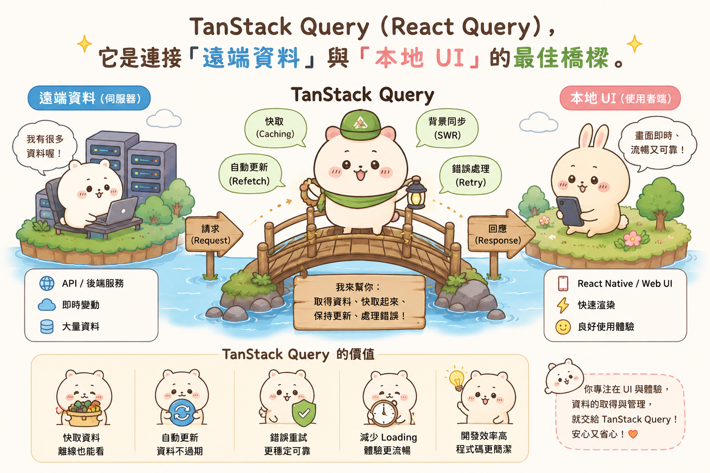
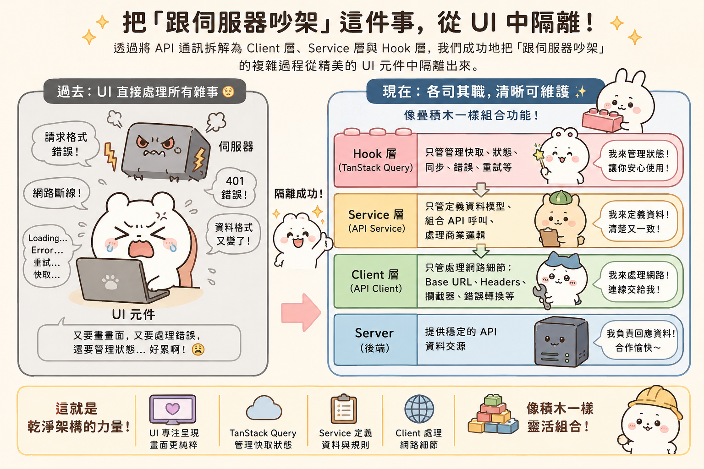

---
mdx:
  format: md
---

> 課程：RN 跨平台開發基礎
> 第 12 堂：APP 架構規劃

# API 層封裝策略

想像一下，你的 APP 正在快速成長。起初只有幾個簡單的 API 呼叫，你很直覺地在元件的 `useEffect` 裡寫下了 `fetch('https://api.example.com/data')`。但隨著功能增加，問題開始接踵而至：後端決定把所有 API 的路徑從 `/v1` 改成 `/v2`；你需要為每個請求都加上 Authorization Token；當 Token 過期時，你希望 APP 能自動導回登入頁面，而不是讓使用者看著轉不停的圈圈。

如果你是把 `fetch` 散落在各個頁面元件中，這時你可能需要打開 20 個檔案手動修改。這種「散彈槍式」的修改不僅痛苦，更極易出錯。本章節將帶你建立一套系統性的 API 封裝架構，將「如何通訊」與「UI 邏輯」徹底解耦，讓你的程式碼從「能跑」進階到「專業級維護」。

## 反面模式：當 API 邏輯寄生在 UI 元件中

在進階開發者的眼中，最危險的程式碼往往長這樣：

```tsx
// ❌ 反面範例：直接在元件內處理 API 邏輯
const UserProfile = ({ userId }) => {
  const [user, setUser] = useState(null);

  useEffect(() => {
    const fetchData = async () => {
      try {
        const response = await fetch(`https://api.myapp.com/users/${userId}`, {
          headers: { 'Authorization': 'Bearer ' + myToken }
        });
        const data = await response.json();
        setUser(data);
      } catch (error) {
        console.error("載入失敗", error);
        Alert.alert("錯誤", "無法取得資料");
      }
    };
    fetchData();
  }, [userId]);

  if (!user) return <ActivityIndicator />;
  return <Text>{user.name}</Text>;
};
```

這段程式碼看起來很面熟，對吧？但在一個正式的專案中，它隱藏了四個巨大的隱患：

1. **邏輯洩漏**：UI 元件不應該知道 API 的完整 URL，也不應該知道如何處理 Authorization Token 的拼接。UI 的職責應該只是「展示資料」與「觸發行為」。
2. **難以複用**：如果另一個頁面也需要取得使用者資料，你只能把這段邏輯再複製貼上一次。
3. **錯誤處理雜亂**：每個元件都要自己寫一套 `try-catch` 和 `Alert.alert`。如果你想把所有網路錯誤都改成用精緻的 Toast 顯示，你得改遍全專案。
4. **難以測試與 Mock**：當邏輯硬編碼在元件中，你很難在不改動程式碼的情況下，模擬 API 失敗或回傳特定測試資料的情境。

為了達成「UI = f(state)」的純粹性，我們需要將 API 通訊抽離出來，建立一套三層式的封裝架構。

## 第一層：建立中央集權的 API Client

封裝的第一步是建立一個統一的入口，我們稱之為 **API Client**。在 React Native 中，最推薦使用 Axios，因為它提供的攔截器（Interceptors）功能比原生的 `fetch` 強大且直覺許多。

這層的核心目標是：**處理與環境、通訊協議相關的雜事。**

### 基礎設定與攔截器

你應該在專案中建立一個 `src/api/client.ts`（或放在 `infrastructure` 資料夾），作為所有請求的基石。

```typescript
import axios from 'axios';
import { Alert } from 'react-native';

const apiClient = axios.create({
  baseURL: 'https://api.yourapp.com/v1',
  timeout: 10000, // 10秒逾時
});

// Request Interceptor：統一注入 Token
apiClient.interceptors.request.use(
  async (config) => {
    const token = await getAuthTokenFromStorage(); // 假設從 AsyncStorage 讀取
    if (token) {
      config.headers.Authorization = `Bearer ${token}`;
    }
    return config;
  },
  (error) => Promise.reject(error)
);

// Response Interceptor：統一處理錯誤
apiClient.interceptors.response.use(
  (response) => response.data, // 讓後續層級直接拿到資料，不需多點一次 .data
  (error) => {
    const status = error.response ? error.response.status : null;

    if (status === 401) {
      // 實戰場景：Token 過期自動導向登入頁
      handleLogoutAndRedirect(); 
      Alert.alert('登入過期', '請重新登入以繼續使用');
    } else if (status === 500) {
      Alert.alert('伺服器錯誤', '後端正在努力修復中，請稍後再試');
    } else if (!status) {
      Alert.alert('網路連線問題', '請檢查您的網路設定');
    }

    return Promise.reject(error);
  }
);

export default apiClient;
```

**為什麼這一層至關重要？**
透過攔截器，你實現了「切面編程（Aspect-Oriented Programming）」。不論你的 APP 有 10 個還是 100 個 API，Token 的注入與 401 錯誤的處理邏輯都只寫了一次。這就是我們之前提到的「DRY (Don't Repeat Yourself)」原則在架構上的體現。

## 第二層：API Modules 與 Repository 模式

有了統一的 Client 後，我們依然不希望在 UI 元件中直接呼叫 `apiClient.get('/posts/123')`。為什麼？因為 `/posts/123` 是一個字串，對 UI 來說沒有語意。如果路徑改了，你還是要搜尋全專案。

我們應該建立 **Service 層**（或稱為 Repository），將具體的 API 路徑封裝成具有語意名稱的函數。

### 結合 Feature-based 結構

回顧我們在 Topic 8.1 討論的目錄結構。在 Feature-based 模式下，這層代碼應該放在該功能模組的 `services` 目錄中：

```text
src/
  features/
    player/
      services/
        player.service.ts  <-- 這一層
      components/
      hooks/
```

在 `player.service.ts` 中，你會定義具體的請求邏輯：

```typescript
import apiClient from '../../../api/client';

export const PlayerService = {
  // 取得播放清單
  getPlaylist: async (categoryId: string) => {
    return apiClient.get(`/playlists`, { params: { categoryId } });
  },

  // 更新播放進度
  updateProgress: async (mediaId: string, seconds: number) => {
    return apiClient.post(`/media/${mediaId}/progress`, { seconds });
  },

  // 取得媒體詳細資訊
  getMediaDetail: async (mediaId: string) => {
    // 這裡還可以做資料清洗 (Data Normalization)
    const rawData = await apiClient.get(`/media/${mediaId}`);
    return {
      id: rawData.id,
      title: rawData.display_title || '無標題',
      coverUrl: rawData.images?.[0]?.url || 'https://placeholder.com/default.jpg',
    };
  }
};
```

**語意化的威力**
現在，當你在 UI 層想要取得播放清單時，你呼叫的是 `PlayerService.getPlaylist('rock')`。這比 `apiClient.get('/playlists?categoryId=rock')` 好讀、好維護得多。更重要的是，這一層扮演了「翻譯官」的角色——如果後端回傳的欄位名稱很難看（例如 `display_title`），你可以在 Service 層就將它轉換成前端習慣的 `title`。

## 第三層：與 TanStack Query 的分層整合

最後，我們需要將這些封裝好的 Service 與 React 的生命週期連接起來。在 Topic 4.4 中，我們介紹了 TanStack Query（React Query），它是連接「遠端資料」與「本地 UI」的最佳橋樑。



在分層架構下，`useQuery` 的 `queryFn` 應該只是簡單地呼叫 Service 層的函數。

```tsx
// src/features/player/hooks/usePlaylist.ts
import { useQuery } from '@tanstack/react-query';
import { PlayerService } from '../services/player.service';

export const usePlaylist = (categoryId: string) => {
  return useQuery({
    queryKey: ['playlist', categoryId],
    queryFn: () => PlayerService.getPlaylist(categoryId),
    staleTime: 1000 * 60 * 5, // 資料 5 分鐘內視為新鮮
  });
};
```

### UI 元件的極致純粹

經過三層封裝後，你的 UI 元件會變得非常清爽：

```tsx
const PlaylistScreen = ({ categoryId }) => {
  const { data, isLoading, error, refetch } = usePlaylist(categoryId);

  if (isLoading) return <LoadingSpinner />;
  if (error) return <ErrorMessage onRetry={refetch} />;

  return (
    <FlatList
      data={data}
      renderItem={({ item }) => <MediaCard media={item} />}
      keyExtractor={item => item.id}
    />
  );
};
```

這就是我們追求的架構終點。讓我們來看看這套架構在實際開發中如何展現價值：

- **場景一：更換 API 套件**
如果你決定從 Axios 換成更加輕量的 `ky` 或者原生的 `fetch`，你只需要修改第一層的 `apiClient`。
- **場景二：後端修改 API 路徑**
如果 `/playlists` 改成了 `/collections`，你只需要修改第二層的 `PlayerService`。
- **場景三：修改快取策略**
如果你覺得資料不需要快取那麼久，你只需要修改第三層的 `usePlaylist` Hook。
- **場景四：UI 樣式微調**
你完全不需要碰任何 API 邏輯，只需要專注在 `PlaylistScreen` 的 JSX 結構上。

## 實戰場景分析：以你的 APP 為例

針對內容/媒體類 APP，有兩個常見的進階挑戰，可以透過這套分層架構優雅地解決：

### 1. 處理 Token 過期與自動導向

在 `apiClient` 的攔截器中，除了 `401` 彈窗，你還可以更進一步。如果你的 APP 使用 `Zustand` 管理使用者狀態，你可以在攔截器中呼叫 `useAuthStore.getState().logout()`。因為這是普通的 JS 檔案，不能使用 Hook，但你可以直接操作 Store 的實例。這能確保整個 APP 的狀態同步：一旦 API 發現你過期，畫面上的「使用者大頭貼」會立刻消失，並跳轉到登入頁。

### 2. 靜默式錯誤監控

你可能不想讓所有錯誤都彈出 Alert 打斷使用者（例如背景更新播放進度失敗時）。你可以在 `apiClient` 的攔截器中，根據 API 的性質決定處理方式。或者在 `apiClient` 中整合 Sentry 等錯誤監控工具，將所有 `500` 錯誤自動回傳到你的後台，而 UI 元件對此完全不知情，依然維持其簡潔性。

### 3. API 異常的通用 Toast 提醒

與其在每個頁面寫錯誤提示，不如在 `apiClient` 的攔截器中調用一個全域的 `Toast.show()`。這樣不論是在哪一個頁面發生的 API 失敗，使用者都能得到統一、精緻的視覺回饋。這不僅提升了 UX，更省下了大量的重複開發時間。

## 為什麼這對 AI 協作很有幫助？

在 vibe coding 的模式下，AI 很容易生成雜亂無章的代碼。但如果你已經建立好了 `apiClient` 和 `PlayerService` 的框架，你可以給 AI 更有質量的 Prompt：

> 「請在 `PlayerService` 中增加一個 `getRecommended` 方法，調用 `/media/recommended` 端點，並幫我寫一個對應的 `useRecommended` Hook，使用 TanStack Query。」

當 AI 看到你的專案中已經有了清晰的封裝模式，它生成的程式碼會自動遵循你的架構，而不是隨便寫一個 `fetch` 給你。這就是「架構引導開發」的力量。

---

## 建立清晰的資料存取分層

透過將 API 通訊拆解為 Client 層、Service 層與 Hook 層，我們成功地把「跟伺服器吵架」的複雜過程從精美的 UI 元件中隔離出來。這種架構讓開發者能像疊積木一樣組合功能：UI 只管呈現、TanStack Query 只管管理快取狀態、Service 只管定義資料模型、Client 只管處理網路細節。



然而，在這一連串的資料流動中，我們還缺少了一道關鍵的安全檢查：資料的型別。如果 Service 層承諾回傳一個 `title` 字串，但後端卻回傳了 `null`，你的 APP 可能會在渲染時崩潰。

在下一部分中，我們將引入 TypeScript 這個強大的安全網。我們將學習如何定義 Navigation 的參數型別，以及如何為 API 的回傳值建立型別守衛（Type Guard），讓 AI 生成的程式碼不僅結構漂亮，更能保證在執行時不會意外閃退。
