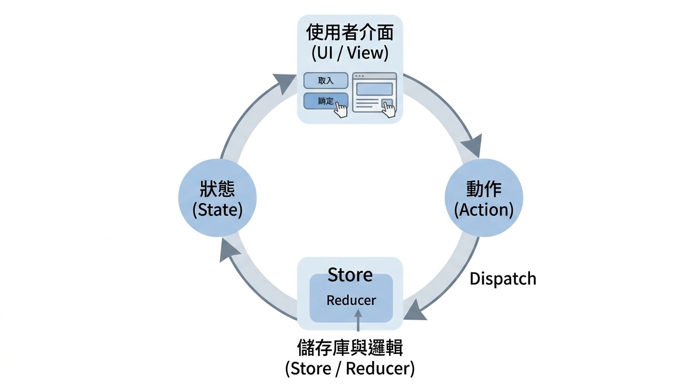

---
mdx:
  format: md
---

> 課程：Redux 思維與 RTK 核心
> 第 1 堂：Redux 思維建立

# 03Action、Reducer、Store 資料流

想像一下，你正在經營一家規模龐大的連鎖咖啡廳。如果店裡的每一位員工——從櫃檯收銀、磨豆師、拉花師到清潔人員——都能隨時隨地根據自己的心情修改公司的總帳本，這家店會變成什麼樣子？

這就是我們在上一節提到的「不可預測性」。在複雜的應用程式中，如果任何元件都能直接修改全域狀態，Debug 將會是一場災難。Redux 為了防止這種混亂，建立了一套極其嚴格的「辦事流程」。

在這一部分，我們將深入探討 Redux 的三位核心成員：**Action**、**Reducer** 與 **Store**，以及它們如何共同協作，構成那條著名的**「單向資料流」（Unidirectional Data Flow）**。

## 核心角色的職責劃分

在進入流程之前，我們必須先釐清這三個角色的「職掌範圍」。你可以把這看作是一個標準化的辦公室作業程序。

### 1. Action：描述「發生了什麼事」的訊息

Action 是 Redux 中唯一的資訊來源。它是一個平凡的 JavaScript 物件（Plain Object），用來描述應用程式中發生的一個「意圖」。

如果你要修改狀態，你**不能**直接說：「嘿，把這個數字加一。」你必須遞交一份「申請書」，這份申請書就是 Action。

一個典型的 Action 在 TypeScript 中看起來像這樣：

```typescript
// 定義 Action 的型別
interface IncrementAction {
  type: 'counter/increment'; // 必須具備 type 欄位
  payload?: number;          // 選填，攜帶額外資訊
}

const action: IncrementAction = {
  type: 'counter/increment',
  payload: 1
};
```

- **type**: 這是一個字串，代表這個動作的名稱。在 Redux 慣例中，通常會寫成 `domain/eventName` 的格式。
- **payload**: 這是攜帶的資料。例如，如果你要新增一則待辦事項，payload 就會是那則訊息的字串。

**教授的叮嚀：** Action 本身不包含任何「如何修改資料」的邏輯。它只是冷冰冰地陳述：「有人點擊了增加按鈕」或是「API 回傳了資料」。它不負責運算，只負責傳遞訊息。

### 2. Reducer：計算邏輯的「加工廠」

如果說 Action 是申請書，那麼 Reducer 就是負責審核並執行修改的「會計師」。

Reducer 是一個**純函數（Pure Function）**，它接收兩個參數：**當前的狀態（Current State）**與**收到的 Action**，然後計算出並回傳一個**全新的狀態（New State）**。

```typescript
// Reducer 的基本邏輯模型：(state, action) => newState
function counterReducer(state = { value: 0 }, action: IncrementAction) {
  switch (action.type) {
    case 'counter/increment':
      // 重要：我們不修改舊 state，而是回傳一個全新的物件
      return { ...state, value: state.value + (action.payload || 1) };
    default:
      return state;
  }
}
```

- **職責**：它是唯一可以定義「狀態如何改變」的地方。
- **純函數特質**：這意味著它不能有副作用（Side Effects），例如發送 API 請求、修改外部變數，或是使用 `Math.random()`。給定相同的輸入，它必須永遠回傳相同的輸出。

### 3. Store：持有狀態的「保險箱」

Store 是整個 Redux 運作的核心容器。一個應用程式中**只會有一個 Store**（單一真理來源）。

Store 承擔了以下任務：

- 儲存應用程式的完整 State 樹。
- 提供 `getState()` 讓元件讀取狀態。
- 提供 `dispatch(action)` 讓元件發送修改意圖。
- 提供 `subscribe(listener)` 讓元件訂閱更新，當狀態改變時，元件能自動重新渲染。

你可以把 Store 想像成一個調度中心，它接收 Action，把它交給 Reducer 運算，最後更新內部的狀態並通知所有人。

---

## 單向資料流：Redux 的生命週期

現在我們認識了所有角色，讓我們把點連成線。Redux 最強大的地方在於它的**單向性**。資料永遠朝著同一個方向流動，這就像一個封閉的循環，沒有人可以走捷徑。

### 全流程解析：從點擊到渲染

當你在 UI 上點擊一個按鈕時，會發生以下過程：

1. **事件觸發 (Event Hook)**：使用者在元件上執行動作（例如：點擊「新增」）。
2. **派發動作 (Dispatch Action)**：元件呼叫 `store.dispatch(action)`。這是唯一能觸發狀態更新的管道。
3. **執行運算 (Reducer Process)**：Store 收到 Action 後，會自動把「目前的 State」和「這個 Action」一起丟給 Reducer。
4. **更新狀態 (Update Store)**：Store 接收 Reducer 回傳的新狀態，並將其替換掉舊狀態。
5. **通知通知 (Subscription/Re-render)**：Store 通知所有訂閱了狀態的 UI 元件。元件發現資料變了，重新讀取資料並更新畫面。

讓我們透過這張圖來視覺化這個循環：



### 為什麼這像是一個「傳聲筒」遊戲？

在沒有 Redux 的情況下，父元件可能要把狀態傳給子元件，子元件再傳給孫元件（Props Drilling）。當孫元件想修改狀態時，可能又要透過 Callback 傳回給父元件。這種「雙向」或「跳躍式」的溝通很容易造成混亂。

在 Redux 的單向流動中，**元件永遠不會直接對話**。

- 元件 A 想改變狀態？它對著 Store 喊一聲（Dispatch Action）。
- 元件 B 想知道狀態？它盯著 Store 看（Select State）。

資料永遠像是一條單向通行的輸送帶。這種模式確保了：

- **來源明確**：當 UI 顯示錯誤資料時，你一定知道是 Store 裡的資料錯了。
- **路徑唯一**：當 Store 資料錯了，你一定知道是某個 Reducer 計算錯了。
- **意圖清晰**：當 Reducer 計算錯了，你可以檢查是哪個 Action 觸發了錯誤的邏輯。

---

## 為什麼「單向」能帶來「可預測性」？

初學者常常會覺得：「我只是想把一個變數加一，為什麼要寫 Action，又要寫 Dispatch，還要寫 Reducer？這不是在繞遠路嗎？」

沒錯，這的確是繞遠路。但這條遠路帶來了兩個極其重要的好處：**可追蹤性（Traceability）**與**可重複性（Reproducibility）**。

### 1. 時間旅行除錯 (Time-Travel Debugging)

因為所有的狀態變更都是透過「發送 Action -> Reducer 產生新物件」來完成的，我們只要記錄下所有的 Action 序列，就能像錄影機回放一樣，重現使用者的操作。

如果使用者回報了一個 Bug，你只需要拿到那一串 Action 清單，在你的電腦上跑一遍，你就能精確地看到狀態在第幾秒、在哪個 Action 之後變得不正常。這在傳統的雙向綁定（Two-way binding）中幾乎是不可能做到的。

### 2. 嚴格的邏輯測試

由於 Reducer 是純函數，測試它變得非常簡單。你不需要模擬瀏覽器環境，也不需要啟動整個 React App。你只需要給它一個狀態 A 和一個動作 B，檢查它是否回傳了預期的狀態 C。

```typescript
// 測試範例（虛擬碼）
expect(counterReducer({ value: 5 }, { type: 'increment' })).toEqual({ value: 6 });
```

這種高度的可預測性，讓 Redux 在大型團隊協作中展現了巨大的價值。即使有 50 個開發者同時開發，只要大家都遵循這套單向流動的規範，狀態的變化就不會失控。

---

## 重點總結與銜接

在這一部分，我們釐清了 Redux 的骨架：

- **Action** 是申請書，負責「說什麼」。
- **Reducer** 是會計師，負責「怎麼做」。
- **Store** 是保險箱，負責「存資料」。
- **單向資料流** 是為了確保每一筆帳目（State Change）都有跡可循。

你可能會開始感覺到，雖然這套理論非常嚴謹，但實際寫起來似乎有點麻煩。在傳統的 Redux 中，你得手寫字串型別、手寫 Action Creator、手寫處理不可變性的邏輯……這就是為什麼許多開發者在初期會覺得 Redux 很「重」。

**這正是 Redux Toolkit (RTK) 出現的原因。**

在下一節中，我們將探討從「傳統 Redux」演進到「現代 RTK」的脈絡。你會發現，RTK 並沒有改變我們今天學到的 Action/Reducer/Store 邏輯，它只是把那些重複、繁瑣的樣板程式碼「自動化」了。讓我們準備進入現代 Redux 的世界，看看 RTK 如何讓這套強大的思維變得輕鬆易用。
