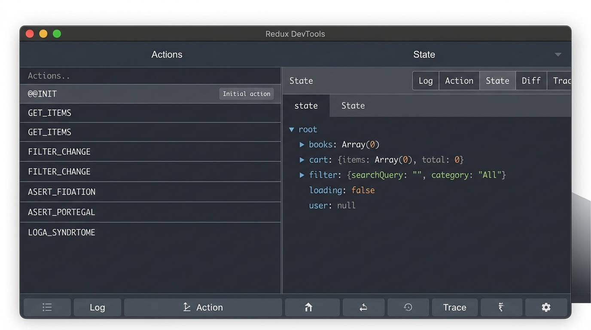

---
mdx:
  format: md
---

> 課程：Redux 思維與 RTK 核心
> 第 2 堂：RTK 環境建置實作

# 08連接 React 與 DevTools

你已經親手打造了一個強大的 Redux 「大腦」（Store），裡面定義了狀態的型別與基礎配置。但目前這個大腦與你的 React 「身體」還是分離的。這就像是你組裝了一台性能強悍的電腦主機，卻還沒有接上螢幕與電源。

在本節中，我們將完成最後的「接線工作」。我們會使用 `react-redux` 提供的橋樑工具，將 Store 注入到 React 應用程式中，並啟動開發者的超級感官——Redux DevTools，親眼見證狀態流動的起點。

## 使用 Provider 掛載 Store

在 React 的世界裡，要讓一個深層的元件樹都能共享某些資訊，最常見的技術就是 **Context API**。`react-redux` 套件正是基於這個原理，提供了一個名為 `<Provider>` 的元件。

### 實作：修改 `main.tsx`

請打開你的 `src/main.tsx`（或是 `main.js`），我們需要將原本的 `<App />` 用 `<Provider>` 包起來。

```typescript
import React from 'react'
import ReactDOM from 'react-dom/client'
import { Provider } from 'react-redux' // 引入橋樑元件
import { store } from './app/store'   // 引入我們剛建立的大腦
import App from './App'
import './index.css'

ReactDOM.createRoot(document.getElementById('root')!).render(
  <React.StrictMode>
    {/* 透過 store prop 將 Redux store 傳遞下去 */}
    <Provider store={store}>
      <App />
    </Provider>
  </React.StrictMode>,
)
```

### 為什麼是 Provider？

`<Provider>` 的作用是將 Redux Store 放在 React 的 Context 中。這意味著：

1. **跨層級存取**：無論你的元件結構有多深，內層的元件都可以透過 Hooks（如 `useSelector`）直接向 Store 索取資料，不再需要透過 Props 一層層傳遞（解決了我們在 Topic 1 提到的 Props Drilling 痛點）。
2. **同步更新**：當 Redux 中的狀態改變時，`<Provider>` 會通知所有訂閱了該狀態的 React 元件進行重新渲染（Re-render）。

**給鐵人賽讀者的寫作小貼士：**
在撰寫這部分的教學文章時，你可以強調：「這是讓 React 應用程式『看見』Redux 大腦的關鍵步驟。」沒有這一步，後續所有的 `useSelector` 或 `useDispatch` 都會因為找不到 Context 而噴出錯誤訊息。

## 為什麼要包在最外層？

有些開發者會好奇：我能不能把 `<Provider>` 包在某個特定的頁面元件裡就好？

雖然技術上可行，但在絕大多數的實務場景中，我們強烈建議將 `<Provider>` 放在應用的**最頂層**（通常是 `main.tsx` 或 `index.tsx`）。

### 1. 全域狀態的本質

Redux 的設計初衷是作為「單一事實來源」（Single Source of Truth）。如果你的應用程式中有些地方在 Provider 之外，那些地方就無法讀取全域狀態。

### 2. 避免邏輯混亂

將 Provider 放在最外層可以確保你的 `App.tsx` 保持乾淨，專注於 UI 佈局與路由設定，而環境配置（如 Redux、Router、Theme Provider）則統一在進入點完成。

### 3. 測試與維護

當你的應用程式結構變得複雜，例如加入了 `react-router` 或 `styled-components` 的 ThemeProvider 時，層層嵌套的 Provider 結構會如下所示：

```tsx
<StrictMode>
  <Provider store={store}>
    <BrowserRouter>
      <ThemeProvider theme={theme}>
        <App />
      </ThemeProvider>
    </BrowserRouter>
  </Provider>
</StrictMode>
```

這是一種類似「裝飾器」的模式，確保了整個應用程式在啟動前，所有的基礎設施都已經就緒。

## 驗證與除錯：Redux DevTools Extension

如果你已經完成了上述的程式碼撰寫，現在你的專案已經具備了 Redux 的功能。但我們要如何確認「真的連上了」？

這就是 **Redux DevTools Extension** 大顯身手的時候了。如果你還沒安裝，請務必在瀏覽器（Chrome/Edge/Firefox）安裝這個擴充功能。它是 Redux 開發者的「X 光機」。

### 如何開啟與觀察

1. 在你的 Vite 預覽頁面上按下 `F12` 開啟開發者工具。
2. 在分頁標籤中找到 **Redux**。
3. 如果你看到左側顯示了 `@@INIT`，恭喜你，連接成功了！



### 關鍵功能導覽

在 DevTools 中，有兩個分頁是你最常使用的：

- **Action 分頁**：這裡紀錄了所有發送到 Store 的動作。
  - 你會看到第一個動作是 `@@INIT`。這是 Redux 內部的初始化訊號。當這個動作發生時，Redux 會執行所有的 Reducer 並收集它們的 `initialState`。
- **即便你現在還沒寫任何邏輯**，只要看到 `@@INIT` 出現，就代表你的 `configureStore` 已經正確運作，且 `Provider` 已經成功掛載。
- **State 分頁**：這裡會顯示目前的狀態樹。
  - 因為我們在 `configureStore` 中還沒放入任何具體的 slice，所以目前的 state 可能是空的物件 `{}`。
- 等到後續我們加入了 `counter` 或 `todo` 邏輯，這裡就會即時反映出資料的變化。

### 為什麼不需要額外設定 DevTools？

這就是 Redux Toolkit (RTK) 的貼心之處。在傳統的 Redux 寫法中，你需要手動撰寫一段複雜的程式碼來連接 DevTools：

```javascript
// 傳統寫法，現在不用這樣做了！
const store = createStore(
  reducer,
  window.__REDUX_DEVTOOLS_EXTENSION__ && window.__REDUX_DEVTOOLS_EXTENSION__()
);
```

但在 RTK 中，`configureStore` 預設就幫你整合好了。只要在開發環境（`process.env.NODE_ENV !== 'production'`），它就會自動開啟這個功能，既省事又安全。

## 建立「最小可運行環境」的成就感

到這一步為止，你已經完成了一套標準的現代前端開發環境建置。這雖然看起來只是一堆配置檔案與包裹元件，但這是一個**「最小可運行環境」（Minimum Viable Environment）**。

為什麼這很重要？

- **排除變數**：如果你現在跳過環境建置直接去寫複雜的邏輯，萬一報錯了，你很難判斷是邏輯寫錯，還是環境沒設好。
- **實作成就**：在鐵人賽文章中，這是一個非常好的檢查點。你可以放上一張 DevTools 成功顯示 `@@INIT` 的截圖，這對跟著你做的讀者來說，是極具說服力的實作成就感。

### 常見錯誤排查

如果在 DevTools 看到 "No store found"，請檢查以下三點：

1. **有沒有存檔？** Vite 的 HMR 有時候會因為語法錯誤而停止更新。
2. **Provider 有沒有包對？** 確保 `<App />` 被包在裡面。
3. **Store 有沒有正確傳入？** `<Provider store={store}>` 這裡的 `store` 必須是你從 `store.ts` 匯出的那個實例。

我們現在已經接好了電源，螢幕也亮了，接下來，我們就要開始為這個大腦注入真正的靈魂——定義功能邏輯。

## 下一個挑戰：Slice 的誕生

我們目前的 Store 雖然連上了，但它是個「空的大腦」。在 Redux Toolkit 的哲學中，我們會將大腦切分成不同的區域，每個區域負責不同的功能，這就是 **Slice（切片）**。

在下一章中，我們將深入探討 `createSlice` 這個 API。你將會看到 RTK 如何神奇地幫我們自動產生 Action 和 Reducer，以及內建的 **Immer** 庫如何讓我們用最直覺的「變更」方式來撰寫「不可變」的狀態更新。

準備好寫下你的第一行業務邏輯了嗎？我們走吧！

## 本節重點總結

- **Provider 是橋樑**：透過 React Context 將 Redux Store 注入整個元件樹。
- **放置頂層**：慣例上將 `<Provider>` 包裹在 `main.tsx` 的最外層，確保全域可用。
- **DevTools 是必備工具**：看見 `@@INIT` 代表環境建置大功告成。
- **RTK 自動化**：`configureStore` 已內建 DevTools 支援，無需額外手動配置。

這標誌著我們「環境建置與初始化」主題的完結。你現在擁有了一個健全的 TypeScript + Redux Toolkit 基礎設施。
